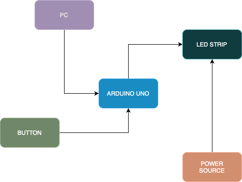

## © 2025 Gabriel-Claudiu TINTU

# Ambiental Lights for PC

## 📌 Introduction

This project is a device that captures the dominant colors displayed on a PC screen and reproduces them on an LED strip mounted behind the monitor. Inspired by TVs with backlight systems, it aims to create a more immersive experience for users, especially gamers. It enhances the visual atmosphere, reduces eye strain in low-light conditions, and brings a modern touch to any setup.

---

## ⚙️ General Description

The system uses an Arduino UNO to control a WS2812B LED strip. It operates in multiple modes that the user can cycle through using a button. One of the modes enables real-time color reproduction based on the screen output, using the Adalight protocol.

<p align="center">
  
</p>

---

## 🛠️ Hardware Design

| Component            | Description                        |
|---------------------|------------------------------------|
| Arduino UNO          | Microcontroller                    |
| WS2812B LED Strip    | Addressable LEDs for color output  |
| Button               | Switches between operation modes   |
| Wires                | Connects all components            |
| Breadboard           | Circuit assembly base              |
| Power Source         | Supplies power to the system       |
| USB Cable            | Connects Arduino to PC             |

---

## 🔌 Circuit


---

## 📐 Schematic


---

## 💻 Software Design

The project uses the **FastLED** library to drive the WS2812B LED strip.

### 🧠 Key Features

- **Interrupt-driven mode switching** via external interrupt on button press
    ```cpp
    ISR(INT0_vect) {
        if ((long)(micros() - lastDebounceTime) >= debounceDelay) {
            mode = (mode + 1) % 4;
            lastDebounceTime = micros();
            updateNeeded = true;
        }
    }
- **Timer-based fade effects** for smooth color transitions
    ```cpp
    ISR(TIMER1_COMPA_vect) {
    if (mode == 2) {  // just in mode 2
        millis_counter++;
            if (millis_counter >= 30) { // every 30 ms
                millis_counter = 0;
                fadeBrightness += fadeDirection * 5;  // change intensity
                if (fadeBrightness >= 255) {
                     fadeBrightness = 255;
                     fadeDirection = -1;  // starts to decrease
                } else if (fadeBrightness <= 0) {
                     fadeBrightness = 0;
                     fadeDirection = 1;   // starts to increase
                     fadeColorIndex = (fadeColorIndex + 1) % 3;  // change color after a complete cycle
                }
                updateNeeded = true;
            }
        }
    }
- **Real-time LED control** using the **Adalight protocol** with compatible software (Prismatik)

### ⚙️ Operating Modes

1. **Mode 0 & 1** – All LEDs display a static color (Red / Green)
2. **Mode 2** – Smooth fade transitions between Magenta, Cyan, and Blue using Timer1
3. **Mode 3** – Real-time color updates via serial connection using Adalight

## 🛠️ Physical Implementation

Here are a few photos of the final assembled circuit and its physical packaging:

<p align="center">
  
  <br/><br/>
  
  <br/><br/>
  
</p>

## 🎥 Demo Videos

Here are a few short demos showing how the system performs in various scenarios:

- ▶️ [Multicolor Test](https://youtu.be/tgFl40qwzO8)
- ▶️ [Movie](https://youtu.be/PxrLqxLwM0I)
- ▶️ [Anyma Visuals](https://youtu.be/g9zJSYMoYSU)


## 📚 Resources


